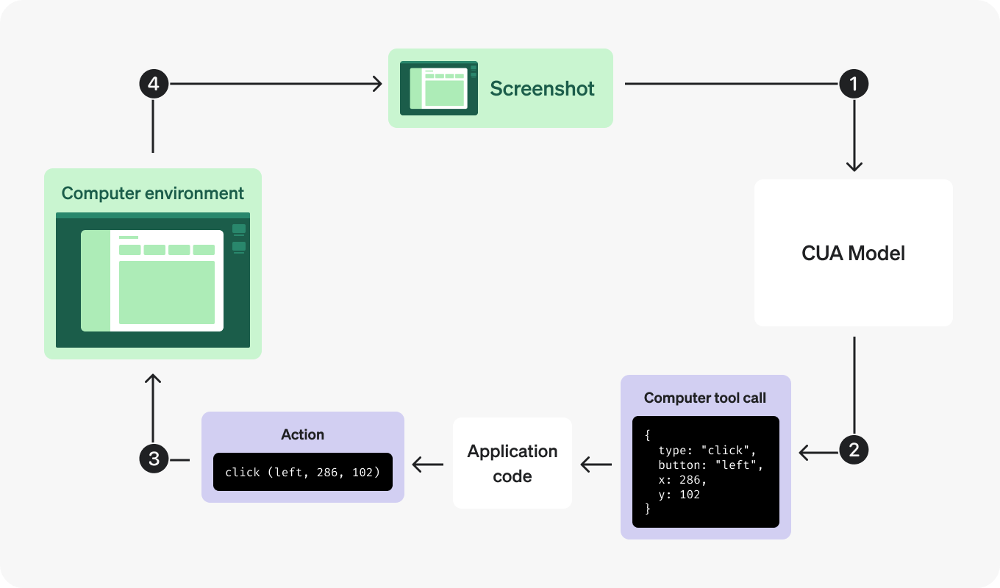

# Architecture

## Overview

TMA Autotest Infra is AI QA infrastructure for Telegram Mini Apps and TON-related web flows. Its purpose is to convert an exploratory browser session performed by an agent into a repeatable automated regression check.

At the center of the system is an agent built around a vision-language model (VLM). The agent follows a reasoning + action execution pattern: it interprets the current state of the interface, decides what to do next, executes a browser action, observes the result, and continues until the task is complete.

This is important for UI automation because many product flows are not cleanly solvable through static selectors alone. Real interfaces contain visual state, overlays, popups, network selectors, language controls, wallet dialogs, and other context that is easier to handle with a perception-capable agent than with a rigid click recorder.

## Architectural Goal

The system is designed to separate two different responsibilities:

- intelligent exploration of the interface
- repeatable regression execution after the exploration is finished

The agent is responsible for discovering and completing the scenario. The generated autotest is responsible for replay-oriented verification. This separation makes the product useful as infrastructure for development teams rather than as a one-off interactive demo agent.

## Agentic Execution Model

### VLM-Based Agent

The exploratory layer is driven by an open-source VLM-based agent core that can reason over the visible browser state and use browser tools to move through the interface.

The agent follows a reasoning + action paradigm:

1. inspect the current UI state
2. infer the next meaningful step
3. call a browser action
4. observe the updated state
5. continue until the task reaches a completion condition

This makes the system suitable for flows where structure and appearance both matter, including Telegram Mini App interfaces and TON wallet connection scenarios.

### Reasoning + Action Loop

  

The agent loop is built around iterative decision making instead of static scripted steps. In practice, this means the system can:

- react to visual changes in the page
- navigate modal-driven interfaces
- perform scroll-dependent interactions
- handle multi-step user journeys
- produce a semantically meaningful execution trace

That trace becomes the bridge between intelligent exploration and deterministic replay.

## Core Pipeline

The full pipeline looks like this:

1. A task is submitted to the system.
2. The VLM-based agent explores the target interface in the browser.
3. The backend stores a structured trace of the execution.
4. A code generation stage transforms the trace into an autotest.
5. A deterministic runtime reruns the generated script.
6. The system stores artifacts for inspection and review.

In compact form:

`agent -> trace -> generated autotest -> rerun -> artifacts`

## Main Components

### 1. Agent Core

The agent core is responsible for exploratory task execution. It combines:

- task understanding
- step-by-step reasoning
- browser tool selection
- completion detection

The agent is optimized for actionability, not just text generation. Its purpose is to interact with the interface and produce a usable execution trace.

### 2. Browser Tooling and Runtime

The browser runtime provides the execution surface for the agent. It exposes the low-level actions needed to operate a real page, including:

- navigation
- clicking
- typing
- scrolling
- waiting
- reading visible state
- capturing screenshots

This layer is where reasoning becomes action.

### 3. Backend Orchestration

The backend coordinates the lifecycle of each run:

- task submission
- session state
- trace capture
- script generation
- rerun execution
- artifact persistence

This layer turns a one-time agent session into a structured and inspectable workflow.

### 4. Trace Layer

The trace layer stores the operational history of the session in a structured format. It is not just a raw event dump. It acts as the intermediate representation between exploration and replay.

The trace is valuable because it preserves:

- what the agent attempted
- what actually happened in the UI
- how the scenario progressed step by step

### 5. Trace-to-Test Generation

Once the exploratory run is complete, the system uses the stored trace as the source material for automated test generation.

This stage converts a successful exploratory run into a reusable software artifact: an autotest that can be executed again later as a regression check.

### 6. Deterministic Test Runtime

The generated test is executed in a replay-oriented runtime. This separates exploration from verification:

- exploration is flexible and agent-driven
- regression is repeatable and test-driven

This architectural split is one of the key strengths of the system.

### 7. Artifact and Reporting Layer

The system stores artifacts that make runs inspectable by humans:

- screenshots
- timeline events
- run diagnostics
- final status

These outputs make the infrastructure useful not only for automation, but also for QA review, debugging, and demo presentation.

## Why VLM Matters Here

A VLM-based agent is especially useful for Telegram Mini Apps and TON-related interfaces because these flows often depend on visible context rather than purely stable markup.

Examples include:

- wallet connection modals
- language selectors
- network selectors
- QR-driven connection flows
- dynamic interface blocks revealed only after scrolling

A perception-capable agent can handle these flows more naturally than a rigid recorder-only approach.

## Why This Is More Than Record-and-Replay

Traditional record-and-replay tools usually capture literal low-level actions and depend heavily on stable UI structure. TMA Autotest Infra instead uses an agentic exploration stage first, then turns the resulting trace into a repeatable regression artifact.

That means the product is better described as AI-assisted QA infrastructure than as a simple test recorder.

## Future MCP Surface

The current submission focuses on the working QA pipeline, not on exposing every capability as a public protocol surface. However, the architecture is intentionally compatible with future MCP-style packaging.

In a later iteration, the same infrastructure can be exposed through an MCP-compatible interface so other agents or developer tools can call capabilities such as:

- create and start exploratory runs
- retrieve traces
- trigger trace-to-test generation
- launch reruns
- fetch artifacts and run status

This means the current architecture can evolve from an internal QA system into a more general agent tooling surface without changing its fundamental design.

## Public vs Private Materials

This showcase repository contains only public submission-facing materials.

The private core repository contains the working implementation of:

- agent orchestration
- browser execution services
- trace capture flow
- trace-to-test generation
- autotest runtime
- internal product UI and integration logic
