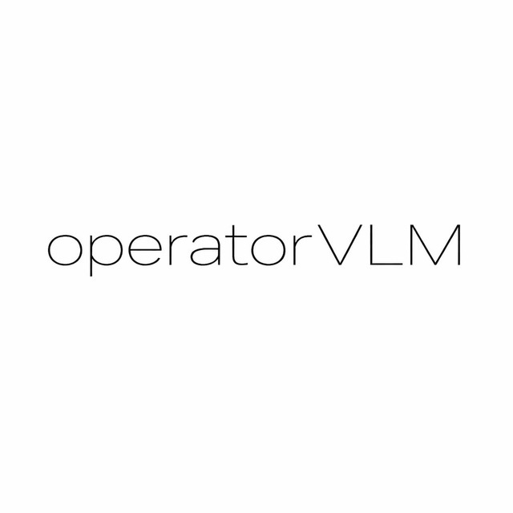
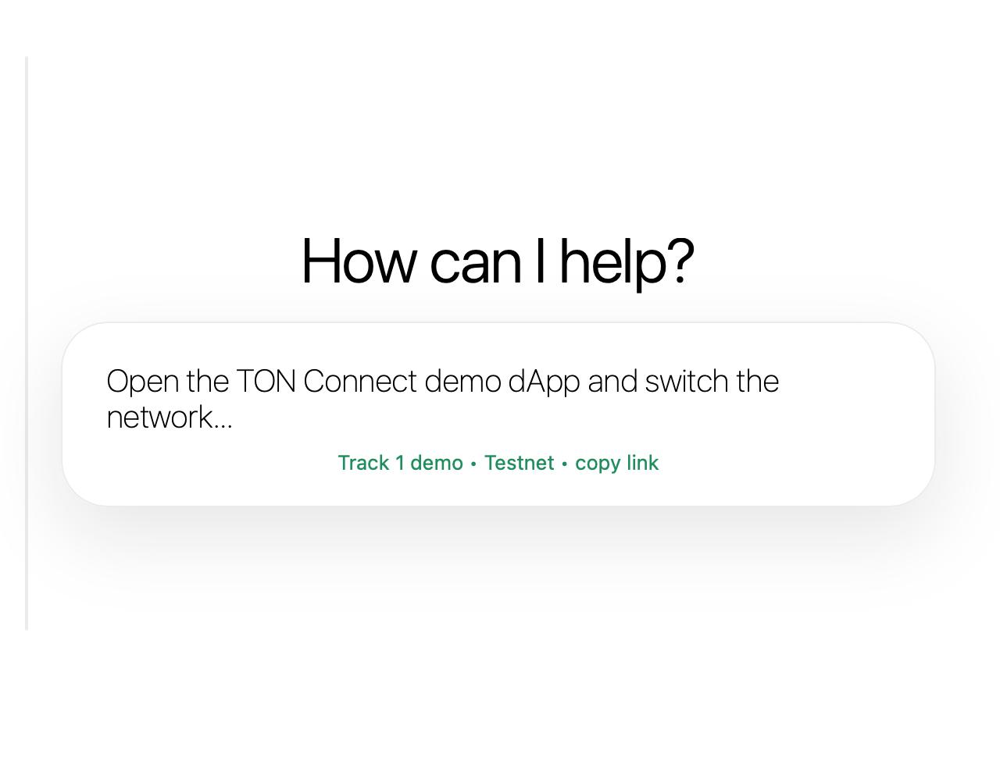
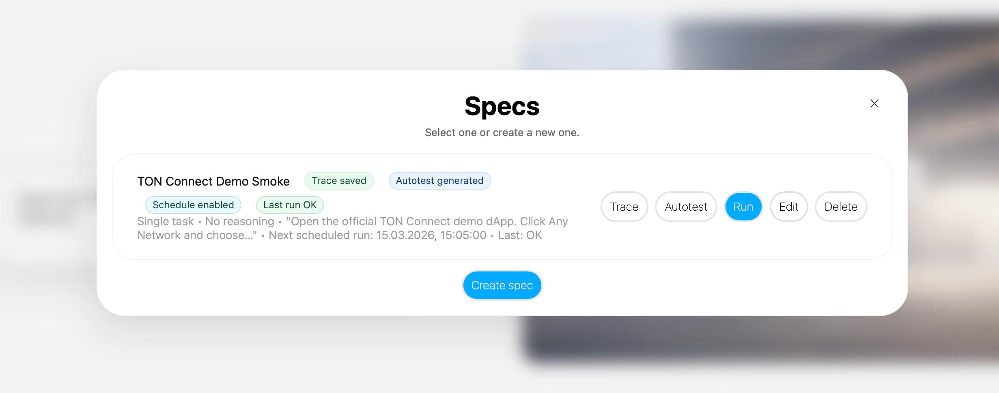

# TMA Autotest Infra — AI QA infrastructure


<p align="center">
  
</p>

<p align="center">

<a href="https://identityhub.app/contests/ai-hackathon">

</a>

<a href="https://operatorvlm.ru">

</a>

<a href="https://t.me/pn_test_auth_bot">

</a>

<a href="./ARCHITECTURE.md">

</a>

</p>

AI QA infrastructure for Telegram Mini Apps and TON-related web flows.

The system turns an exploratory browser session executed by an AI agent into a repeatable automated regression test.  
It allows teams to validate UI flows, capture interaction traces, generate automated tests, and inspect execution artifacts.

---

# Hackathon Track

TON AI Agent Hackathon 2026  
Track 1: Agent Infrastructure

---

# Problem

Teams building Telegram Mini Apps and TON-related web products constantly modify onboarding flows, wallet connection steps, and interface logic.

Manual regression testing is slow and expensive, while traditional record-and-replay tools tend to break when the UI changes.

As a result, teams often lack reliable regression coverage for critical interaction flows.

---

# Solution
<p align="center">
  
</p>
The system provides an AI-assisted QA pipeline:

1. The user describes the verification goal and configures the reasoning level for the agent.
2. The AI agent explores the interface inside a browser environment, interacting with the UI similarly to a human user.
3. During exploration the agent forms hypotheses about possible checks and interacts with elements accordingly.
4. The generated test can later be rerun in a deterministic execution mode (via timer or other triggers).
5. After execution the team receives a final report.

The report includes either:

- confirmation of successful execution, or  
- recommendations describing problems detected during the agent or script execution.

This approach allows teams to move much faster from exploratory UI testing to repeatable regression coverage.

Additionally, it helps evaluate how understandable and usable the interface is from the perspective of an autonomous agent.

---

# Demo Scenario

Current public target:

`https://tonconnect-sdk-demo-dapp.vercel.app/`

Validated interaction flow:

<p align="center">
<a href="https://youtu.be/AuMUIWpe7jE">
  
</a>
</p>

<p align="center">
▶ Watch demo
</p>

1. Open the official TON Connect demo dApp.
2. Switch `Any Network` to `Testnet`.
3. Scroll down and select the `ru` language.
4. Scroll back up and open `Connect Wallet`.
5. Press the copy-link control next to the QR code.
6. Save the action trace.
7. Generate an autotest from the trace.
8. Rerun the generated autotest and inspect run artifacts.

This scenario has already been validated end-to-end in the core product.

The demo shows:

- how the agent reasons about the interface  
- how it interacts with UI elements  
- how high-quality grounding enables reliable UI interaction

---

# What Makes It Different

This is not a simple click recorder.

The interface is first explored by an AI agent capable of reasoning about UI elements and forming interaction hypotheses.

The resulting interaction trace becomes the source for a separate repeatable automated test.

This makes the system closer to **AI-assisted QA infrastructure** rather than a traditional record-and-replay tool.

---

# Repository Contents

- [`ARCHITECTURE.md`](./ARCHITECTURE.md) — system architecture and component responsibilities  
- [`DEMO.md`](./DEMO.md) — demo walkthrough and expected results  
- [`ADDITIONAL_NOTES.md`](./ADDITIONAL_NOTES.md) — notes for hackathon judges about the private implementation  

---

# Private Core Notice

The core implementation of the product is currently private.

This repository serves as a **public showcase repository** for the hackathon submission and intentionally contains:

- product overview
- architecture summary
- validated demo flow
- submission-facing documentation

The private repository contains:

- production backend
- browser runtime
- trace-to-test generation pipeline
- internal integrations

---

# Current Status

The MVP already works end-to-end on the public TON Connect demo target.

Current capabilities include:

- exploratory agent run
- interaction trace capture
- autotest generation
- deterministic test rerun
- artifact inspection

---

# Scope of This Submission

This submission focuses on **QA infrastructure for Telegram Mini Apps and TON-related web flows**.

It does not focus on TON payments or on a consumer-facing chat agent.

The core value of the system is the pipeline:

```

explore -> trace -> generate test -> rerun -> inspect artifacts

```

At the current stage, direct payment integration with TON is not implemented.

Monitoring and payment management are currently handled through a Telegram bot and fiat payment flows.

In an upcoming release, the platform will introduce MCP connectivity, allowing external agents and systems to interact with the infrastructure, as well as native payment support through the TON ecosystem.
